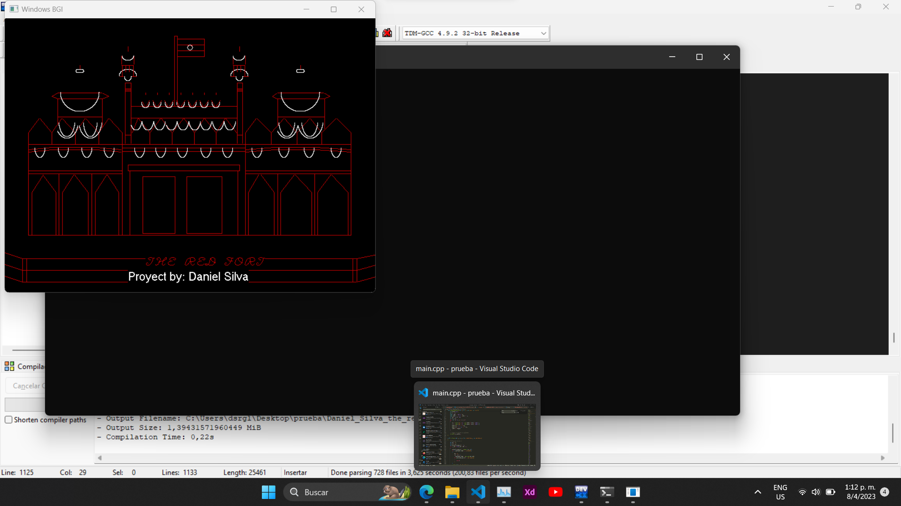

# graphics.h
proyecto para computacion grafica donde dibujo the red ford de la india y uso las funciones de relleno de cada forma primitiva

Este Contiene: 
-Punto()
Linea()
LineaDiscontinua()
Circulo()
CirculoRelleno()
Elipse()
ElipseRellena()
Rectangulo()
RectanguloRelleno()
Cuadrado()
CuadradoRelleno()
TrianguloEquilatero()
TrianguloEquilateroRelleno()
TrianguloIsosceles()
TrianguloIsoscelesRelleno()
TrianguloRectangulo()
TrianguloRectanguloRelleno()
Pentagono()
PentagonoRelleno()
Hexagono()
HexagonoRelleno()
Heptagono()
HeptagonoRelleno()
Octagono()
OctagonoRelleno()
Rellenar()
LimpiarArea()
LimpiarPantalla()
