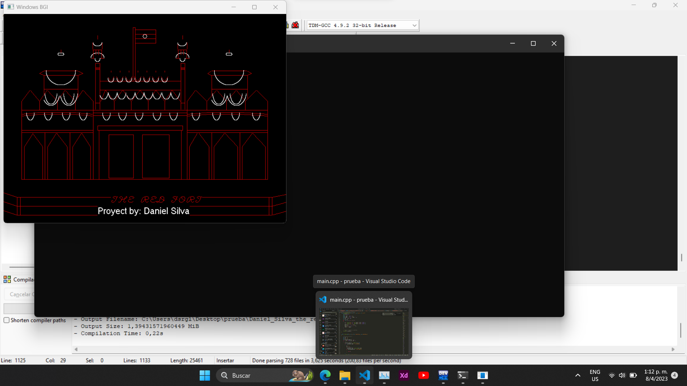

# graphics.h
proyecto para computacion grafica donde dibujo the red ford de la india y uso las funciones de relleno de cada forma primitiva

Este Contiene: 


# Linea()

```cpp
void Linea(int x1, int y1, int x2, int y2, int color = RED){
    int dx = abs(x2 - x1);
    int dy = abs(y2 - y1);
    int sx = (x1 < x2) ? 1 : -1;
    int sy = (y1 < y2) ? 1 : -1;
    int err = dx - dy;
    while (x1 != x2 || y1 != y2){
        putpixel(x1, y1, color);
        int e2 = 2 * err;
        if (e2 > -dy){
            err -= dy;
            x1 += sx;
        }
        if (e2 < dx){
            err += dx;
            y1 += sy;
        }
    }
}
Linea(100, 100, 200, 200);
``` 


# LineaDiscontinua()
```cpp
void LineaDiscontinua(int x1, int y1, int x2, int y2){
    const int dashSize = 5; // longitud de la seccion discontinua
    int dx = abs(x2 - x1);
    int dy = abs(y2 - y1);
    int sx = (x1 < x2) ? 1 : -1;
    int sy = (y1 < y2) ? 1 : -1;
    int err = dx - dy;
    int count = 0;
    while (true){
        if (count == dashSize){
            count = 0;
        }
        else if (count < dashSize / 2){
            putpixel(x1, y1, RED); // Dibuja un punto blanco
        }
        x1 += sx;
        err += 2 * dy;
        if (err > 0){
            y1 += sy;
            err -= 2 * dx;
        }
        if ((sx > 0 && x1 > x2) || (sx < 0 && x1 < x2)){
            break;
        }
        if ((sy > 0 && y1 > y2) || (sy < 0 && y1 < y2)){
            break;
        }
        count++;
    }
}
```

# Circulo()

```cpp
void Circulo(int x, int y, int r, int color = RED){
    int xi, yi, xf, yf;
    float theta = 0.0;
    while (theta <= 2 * M_PI){
        xi = round(r * cos(theta) + x);
        yi = round(r * sin(theta) + y);
        theta += 0.01;
        xf = round(r * cos(theta) + x);
        yf = round(r * sin(theta) + y);
        Linea(xi, yi, xf, yf, color);
    }
}
```

# Punto()

```cpp
void Punto(int x, int y, int size, int color){
    // Set color and size of point
    setcolor(color);
    setfillstyle(SOLID_FILL, color);
    setlinestyle(0, 0, size);

    // Draw point at (x, y)
    Circulo(x, y, 0, color);
    floodfill(x, y, color);
}
```

# CirculoRelleno()

```cpp
void CirculoRelleno(int x, int y, int r, int color){
    setcolor(color);
    setfillstyle(SOLID_FILL, color); // Establece el estilo para el relleno
    // Fill the circle by drawing horizontal lines from top to bottom
    for (int i = y - r; i <= y + r; i++){
        for (int j = x - r; j <= x + r; j++){
            if (pow(j - x, 2) + pow(i - y, 2) <= pow(r, 2)){
                putpixel(j, i, color);
            }
        }
    }
}
```

# Elipse()

```cpp
void Elipse(int x, int y, int stangle, int endangle, int xradius, int yradius, int color = WHITE){
    float angle, step;
    if (stangle > endangle{
        endangle += 360;
    }
    step = (float)1 / sqrt(xradius * xradius + yradius * yradius);
    for (angle = stangle; angle < endangle; angle += step){
        float radian = angle * 3.1416 / 180;
        int x_point = x + cos(radian) * xradius;
        int y_point = y + sin(radian) * yradius;
        putpixel(x_point, y_point, color); // Puedes cambiar el color aqui
    }
}
```

# ElipseRellena()

```cpp
void ElipseRelleno(int x, int y, int stangle, int endangle, int xradius, int yradius, int color){
    setfillstyle(SOLID_FILL, color);
    Elipse(x, y, stangle, endangle, xradius, yradius);
    fillellipse(x, y, xradius, yradius);
}
```

# Rectangulo()

```cpp
void Rectangulo(int left, int top, int right, int bottom, int color = RED){

    // Draw the lines of the Rectangulo
    Linea(left, top, right, top);       // Top line
    Linea(right, top, right, bottom);   // Right line
    Linea(right, bottom, left, bottom); // Bottom line
    Linea(left, bottom, left, top);     // Left line
                                        // Fill the Rectangulo
}
```

# RectanguloRelleno()

```cpp
void RectanguloRelleno(int left, int top, int right, int bottom, int color = RED){
    Rectangulo(left, top, right, bottom);
    for (int y = top + 1; y < bottom; y++){
        // Draw a semirrecta from left to right
        int start_x = left + 1;
        int end_x = right;
        for (int x = start_x; x < end_x; x++)
        {
            putpixel(x, y, color);
        }
    }
}
```

# Cuadrado()

```cpp
void Cuadrado(int x, int y, int size){
    Rectangulo(x, y, x + size, y + size);
}
```

# CuadradoRelleno()

```cpp
void CuadradoRelleno(int x, int y, int size, int color){

    RectanguloRelleno(x, y, x + size, y + size, BLUE);
}
```

# TrianguloEquilatero()

```cpp
void TrianguloEquilatero(int x, int y, int lado){
    double altura = sqrt(3) / 2 * lado;

    int x1 = x - lado / 2;
    int y1 = y + altura / 3;

    int x2 = x + lado / 2;
    int y2 = y + altura / 3;

    int x3 = x;
    int y3 = y - 2 * altura / 3;

    Linea(x1, y1, x2, y2);
    Linea(x2, y2, x3, y3);
    Linea(x3, y3, x1, y1);
}
```

# TrianguloEquilateroRelleno()

```cpp
void TrianguloEquilateroRelleno(int x, int y, int lado, int color){
    double altura = sqrt(3) / 2 * lado;

    int x1 = x - lado / 2;
    int y1 = y + altura / 3;

    int x2 = x + lado / 2;
    int y2 = y + altura / 3;

    int x3 = x;
    int y3 = y - 2 * altura / 3;

    // Traza lineas entre los tres vertices del triángulo equilátero
    Linea(x1, y1, x2, y2);
    Linea(x2, y2, x3, y3);
    Linea(x3, y3, x1, y1);

    // Rellenar la forma con el color
    setfillstyle(SOLID_FILL, color);
    int poly[8] = {x1, y1, x2, y2, x3, y3, x1, y1};
    fillpoly(4, poly);
}
```

# TrianguloIsosceles()

```cpp
void TrianguloIsosceles(int x, int y, int base, int altura){
    int x1 = x - (base / 2);
    int y1 = y + (altura / 2);
    int x2 = x;
    int y2 = y - (altura / 2);
    int x3 = x + (base / 2);
    int y3 = y + (altura / 2);

    Linea(x1, y1, x2, y2);
    Linea(x2, y2, x3, y3);
    Linea(x3, y3, x1, y1);
}
```

# TrianguloIsoscelesRelleno()

```cpp
void TrianguloIsoscelesRelleno(int x, int y, int base, int altura, int color){
    int x1 = x - (base / 2);
    int y1 = y + (altura / 2);
    int x2 = x;
    int y2 = y - (altura / 2);
    int x3 = x + (base / 2);
    int y3 = y + (altura / 2);
    // Escanear cada fila del triangulo
    for (int fila = y2 + 1; fila <= y1; fila++){
        int dx = abs(fila - y2);
        int xi = x2 - (dx * base) / (2 * altura);
        int xf = x2 + (dx * base) / (2 * altura);
        for (int col = xi + 1; col <= xf - 1; col++){
            putpixel(col, fila, color); // Pintar el pixel en (col, fila)
        }
    }
    TrianguloIsosceles(x, y, base, altura); // Dibujar la linea del triangulo despues de pintar
}
```

# TrianguloRectangulo()

```cpp
void TrianguloRectangulo(int x, int y, int base, int altura, int color = WHITE){
    int x2 = x;
    int y2 = y - altura;
    // For each row in the triangle, set the color of the pixels in the row
    for (int fila = y; fila >= y2 + 1; fila--){
        // Calculate the x-coordinates of the two endpoints of the row
        int dx = abs(fila - y2);
        int xi = x2 - (dx * base) / altura;
        int xf = x2;
        // For each pixel in the row, set the color to 'color'
        for (int col = xi + 1; col <= xf - 1; col++)
        {
            putpixel(col, fila, color);
        }
    }
}
```

# TrianguloRectanguloRelleno()

```cpp
void TrianguloRectanguloRelleno(int x, int y, int base, int altura, int color){
    TrianguloRectangulo(x, y, base, altura); // Dibujar el triángulo rectángulo
    int x2 = x;
    int y2 = y - altura;
    // For each row in the triangle, set the color of the pixels in the row
    for (int fila = y; fila >= y2 + 1; fila--){
        // Calculate the x-coordinates of the two endpoints of the row
        int dx = abs(fila - y2);
        int xi = x2 - (dx * base) / altura;
        int xf = x2;
        // For each pixel in the row, set the color to 'color'
        for (int col = xi + 1; col <= xf - 1; col++){
            putpixel(col, fila, color);
        }
    }
}
```

# Pentagono()

```cpp
void Pentagono(int x[], int y[], int n){
    // Draw the pentagon using line()
    int i;
    for (i = 0; i < n - 1; i++){
        Linea(x[i], y[i], x[i + 1], y[i + 1]);
    }
    Linea(x[n - 1], y[n - 1], x[0], y[0]);
}
```

# PentagonoRelleno()

```cpp
void PentagonoRelleno(int x[], int y[], int n, int color){
    // Draw and fill the pentagon
    setcolor(color);
    setfillstyle(SOLID_FILL, color);
    int vertices[n * 2];
    for (int i = 0; i < n; i++){
        vertices[i * 2] = x[i];
        vertices[i * 2 + 1] = y[i];
    }

    // Draw and fill the polygon
    fillpoly(n, vertices);
}
```

# Hexagono()

```cpp
void Hexagono(int x, int y, int r, int color){
    int i;
    int ox, oy, px, py;

    // Calcula los puntos del hexagono
    ox = x;
    oy = y;
    px = x + r;
    py = y;
    Linea(ox, oy, px, py);
    for (i = 1; i < 6; i++){
        ox = px;
        oy = py;
        px = x + r * cos(i * M_PI / 3.0);
        py = y + r * sin(i * M_PI / 3.0);
        Linea(ox, oy, px, py);
    }
    Linea(px, py, x + r, y);
}
```

# HexagonoRelleno()

```cpp
void HexagonoRelleno(int x, int y, int r, int color){
    setcolor(color);
    setfillstyle(SOLID_FILL, color); // establece el estilo para el relleno
    int i;
    int ox, oy, px, py;

    // Calcula los puntos del hexagono
    ox = x;
    oy = y;
    px = x + r;
    py = y;
    Linea(ox, oy, px, py);
    for (i = 1; i < 6; i++){
        ox = px;
        oy = py;
        px = x + r * cos(i * M_PI / 3.0);
        py = y + r * sin(i * M_PI / 3.0);
        Linea(ox, oy, px, py);
    }
    Linea(px, py, x + r, y);
    floodfill(x + r / 2, y + r / 2, color); // Rellena el hexagono con el color
}
```

# Heptagono()

```cpp
void Heptagono(int x, int y, int radius){
    int n = 7; // numero de lados del heptagono
    float angle = 360.0 / n;
    float theta = -90.0;
    int x0 = 0, y0 = 0;
    int x1, y1;

    for (int i = 0; i <= n; i++){
        // Calcular los puntos final e inicial para la linea del heptagono
        x1 = round(radius * cos(theta * M_PI / 180.0));
        y1 = round(radius * sin(theta * M_PI / 180.0));
        if (i > 0){
            Linea(x + x0, y + y0, x + x1, y + y1);
        }
        x0 = x1;
        y0 = y1;
        // Calcular el siguiente angulo
        theta += angle;
    }
}
```

# HeptagonoRelleno()

```cpp
void HeptagonoRelleno(int x, int y, int radius, int color){

    Heptagono(x, y, radius);
    // Establecer el color del relleno
    setfillstyle(SOLID_FILL, color);

    // Definir el arreglo de puntos del polígono
    int puntos[14];
    int n = 7;
    float angle = 360.0 / n;
    float theta = -90.0;
    int x0 = 0, y0 = 0;
    int x1, y1;
    for (int i = 0; i <= n; i++){
        x1 = round(radius * cos(theta * M_PI / 180.0));
        y1 = round(radius * sin(theta * M_PI / 180.0));
        puntos[i * 2] = x + x1;
        puntos[i * 2 + 1] = y + y1;
        theta += angle;
    }

    // Dibujar y rellenar el polígono
    fillpoly(n, puntos);
}
```

# Octagono()

```cpp
void Octagono(int x, int y, int lado){
    int n = 8; // número de lados del octagono
    float angle = 360.0 / n;
    float theta = -45.0 + angle / 2;
    int x0 = 0, y0 = 0;
    int x1, y1;

    for (int i = 0; i <= n; i++){
        // Calcular los puntos final e inicial para la linea del octágono
        x1 = round(lado / 2 * cos(theta * M_PI / 180.0));
        y1 = round(lado / 2 * sin(theta * M_PI / 180.0));
        if (i > 0){
            // Dibujar la linea del octagono
            Linea(x + x0, y + y0, x + x1, y + y1);
        }
        x0 = x1;
        y0 = y1;
        // Calcular el siguiente angulo
        theta += angle;
    }
    // Dibujar la última línea del octágono
    Linea(x + x0, y + y0, x + x1, y + y1);
}
```

# OctagonoRelleno()

```cpp
void OctagonoRelleno(int x, int y, int lado, int color){
    Octagono(x, y, lado);

    // Establecer el color del relleno
    setfillstyle(SOLID_FILL, color);

    // Definir el arreglo de puntos del polígono
    int puntos[16];
    int n = 8;
    float angle = 360.0 / n;
    float theta = -45.0 + angle / 2;
    int x0 = 0, y0 = 0;
    int x1, y1;
    for (int i = 0; i <= n; i++){
        x1 = round(lado / 2 * cos(theta * M_PI / 180.0));
        y1 = round(lado / 2 * sin(theta * M_PI / 180.0));
        puntos[i * 2] = x + x1;
        puntos[i * 2 + 1] = y + y1;
        theta += angle;
    }

    // Dibujar y rellenar el polígono
    fillpoly(n, puntos);
}
```

# Rellenar()

```cpp
void Rellenar(int x, int y, int colorRelleno, int colorBorde){
    /*25% abajo derecha*/
    int xR = x;
    int yR = y;
    int colorPixelActual = -1;
    for (; xR < 1200; xR = xR + 1){
        colorPixelActual = getpixel(xR, yR);
        if (colorPixelActual == colorBorde){
            xR = x;
            yR = yR + 1;
            colorPixelActual = getpixel(xR, yR);
            if (colorPixelActual == colorBorde){
                break;
            }
        }
        putpixel(xR, yR, colorRelleno);
    }
    /*25% abajo izquierda*/
    xR = x;
    yR = y;
    colorPixelActual = -1;
    for (; xR >= 0; xR = xR - 1){
        colorPixelActual = getpixel(xR, yR);
        if (colorPixelActual == colorBorde){
            xR = x;
            yR = yR + 1;
            colorPixelActual = getpixel(xR, yR);
            if (colorPixelActual == colorBorde){
                break;
            }
        }
        putpixel(xR, yR, colorRelleno);
    }
    /*25%  izquierda arriba*/
    xR = x;
    yR = y;
    colorPixelActual = -1;
    for (; xR >= 0; xR = xR - 1){
        colorPixelActual = getpixel(xR, yR);
        if (colorPixelActual == colorBorde){
            xR = x;
            yR = yR - 1;
            colorPixelActual = getpixel(xR, yR);
            if (colorPixelActual == colorBorde){
                break;
            }
        }
        putpixel(xR, yR, colorRelleno);
    }
    /* 25 derecha arriba*/
    xR = x;
    yR = y;
    colorPixelActual = -1;
    for (; xR < 1200; xR = xR + 1){
        colorPixelActual = getpixel(xR, yR);
        if (colorPixelActual == colorBorde){
            xR = x;
            yR = yR - 1;
            colorPixelActual = getpixel(xR, yR);
            if (colorPixelActual == colorBorde){
                break;
            }
        }
        putpixel(xR, yR, colorRelleno);
    }
}
```

# LimpiarArea()

```cpp
/**
 * The function "LimpiarArea" clears a percentage of the screen by filling it with the background
 * color.
 *
 * @param percent The percentage of the screen area to be cleared.
 */
void LimpiarArea(int percent){
    int width = getmaxx();
    int height = getmaxy();
    int x1 = 0;
    int y1 = 0;
    int x2 = width * percent / 100;
    int y2 = height * percent / 100;
    setcolor(getbkcolor());
    setfillstyle(SOLID_FILL, getbkcolor());
    bar(x1, y1, x2, y2);
}
```

# LimpiarPantalla()

```cpp
void LimpiarPantalla(){
    cleardevice();
}
```

